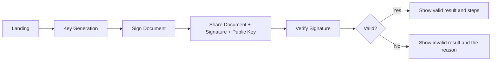

# Flow Overview

## Main Flow

1. The signer opens the app and generates a key pair.
2. The signer uploads a document and signs it with the private key.
3. The signer shares the document, signature, and public key with the verifier.
4. The verifier uploads the same document, the signature, and the public key.
5. The app recomputes the hash and checks whether the signature is valid.

## Flow Diagram

## User Experience Notes

- Key generation can be slower than the other flows because it searches for primes.
- Signing and verification should show the document hash so the user can trace the math.
- Error states must explain what the user can fix: bad file, missing key, malformed JSON, or invalid signature.
- The education mode should keep the intermediate values visible instead of hiding them behind a generic success message.
